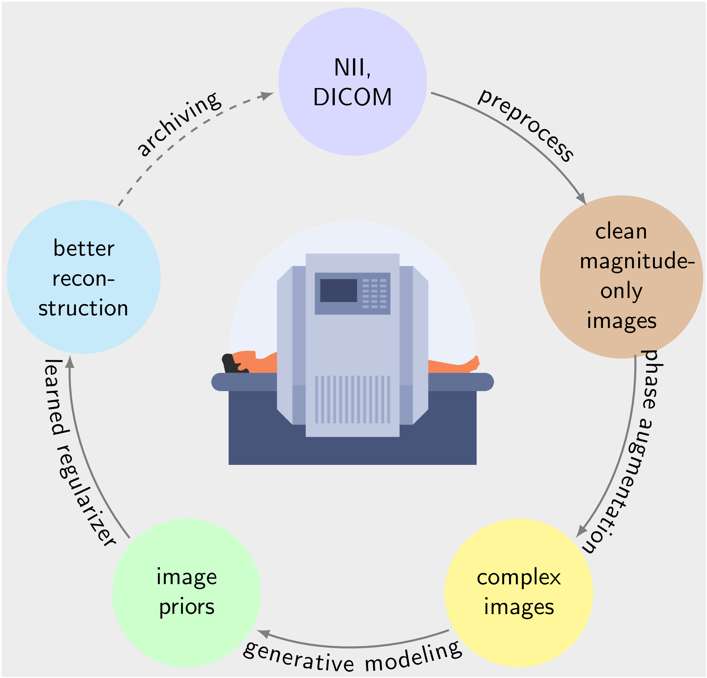

## Speed up MR scanner with generative priors for image reconstruction (SPRECO)


This package is to help you train generative image priors of MRI images and then use them in image reconstruction. It has the following features:

1. Distributed training
2. Interruptible training
3. Efficient dataloader for medical images
4. Customizable with a configuration file
5. Seamless deployment with [BART](https://github.com/mrirecon/bart)

**Installation:** Clone this repository and use [conda](https://www.anaconda.com/products/individual) to set up the environment.

```shell
$ git clone https://github.com/mrirecon/spreco.git
$ cd spreco
$ pip install .
```
<!-- 
## Quickstart with colab

1. Sample the posterior 
   - [Jupyter Notebook](https://github.com/mrirecon/spreco/blob/main/examples/scripts/demo_recon.ipynb)
   - [](https://colab.research.google.com/github/mrirecon/spreco/blob/main/examples/scripts/demo_recon.ipynb)
2. Train an image prior
   - [Jupyter Notebook](https://github.com/mrirecon/spreco/blob/main/examples/scripts/demo_train.ipynb)
   - [](https://colab.research.google.com/github/mrirecon/spreco/blob/main/examples/scripts/demo_train.ipynb)
3. Using Prior with BART
   - [Jupyter Notebook](https://github.com/mrirecon/bart-workshop/blob/master/ismrm2021/bart_tensorflow/bart_tf.ipynb)
   - [](https://colab.research.google.com/github/mrirecon/bart-workshop/blob/master/ismrm2021/bart_tensorflow/bart_tf.ipynb)-->

## Reference 
We would appreciate it if you tried our codes and cited our work.

[1] G. Luo, X. Wang, M. Blumenthal, M. Schilling, EHU. Rauf, R. Kotikalapudi, NK. Focke, M. Uecker. Generative image priors for MRI reconstruction trained from magnitude-only images. arXiv preprint arXiv:2308.02340 (2023)

[2] G. Luo, M. Blumenthal, M. Heide, M. Uecker. Bayesian MRI reconstruction with joint uncertainty estimation using diffusion models. Magn Reson Med. 2023; 1-17

[3] M. Blumenthal, G. Luo, M. Schilling, HCM. Holme, M. Uecker. Deep, deep learning with BART. Magn Reson Med. 2023; 89: 678- 693.

[4] G. Luo, N. Zhao, W. Jiang, ES. Hui, P. Cao. MRI reconstruction using deep Bayesian estimation. Magn Reson Med. 2020; 84: 2246-2261.

